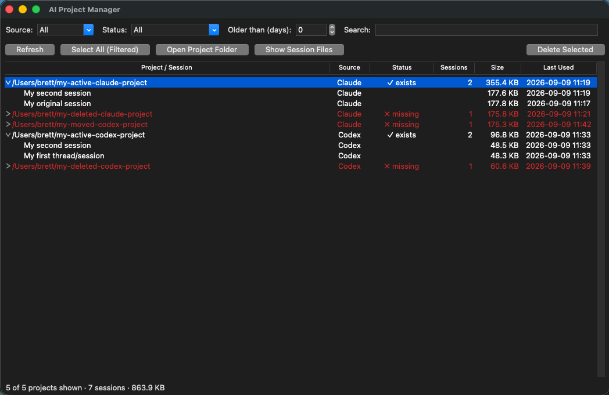
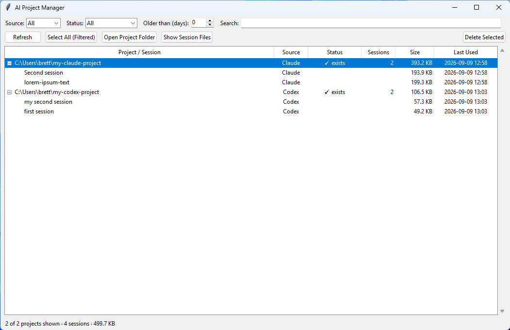

# AI Project Manager

A zero-dependency Tkinter GUI for macOS and Windows that lists your **Claude Code** (`~/.claude/projects`) and **Codex** (`~/.codex/sessions`) projects and sessions, shows whether each project's source folder still exists, and lets you clean up old data by moving it to the macOS Trash or Windows Recycle Bin.





## Features

- Unified view of Claude Code and Codex projects with per-project session counts, sizes, and last-used dates
- Status per project: `✓ exists`, `✗ missing` (folder is gone), `☁ unavailable` (OneDrive/CloudStorage path not currently synced), `? unresolved`
- Filters: source (Claude/Codex), status, "older than N days", and path search — combine with **Select All (Filtered)** for bulk cleanup (e.g. filter to *Missing only* → select all → delete)
- Expand a project to delete individual sessions
- Deletions go to the **macOS Trash** via Finder (with "Put Back" support; falls back to moving into `~/.Trash` if Finder automation is denied) or the **Windows Recycle Bin** via the shell API
- Open the project's source folder, or jump straight to its stored session files (~/.claude / ~/.codex), in Finder/Explorer

## Correctness notes

- Claude project dir names encode paths lossily (`/` → `-`), so the real path is resolved by reading the `cwd` field inside session files, falling back to `~/.claude/history.jsonl` — never by decoding the dir name.
- Deleting a Claude session removes both `<uuid>.jsonl` and its sidecar `<uuid>/` directory (subagent transcripts, tool results).
- Deleting a whole Claude project also removes its `memory/` folder (Claude's saved project memory) — the confirm dialog warns when one is present.
- Codex has no per-project directories; sessions are grouped by their recorded `cwd`, and deleting a "project" deletes its session files (empty date directories are pruned afterwards).

## Installation

### Prebuilt executables (no Python required)

Tagged releases include a standalone `AIProjectManager.exe` (Windows) and `AIProjectManager-macos.zip` (macOS) built by GitHub Actions — download from the [Releases page](https://github.com/Archer36/py-ai-project-manager/releases) and run; no Python install and no admin rights needed. Because the binaries are unsigned, Windows SmartScreen shows "Windows protected your PC" (click **More info → Run anyway**) and macOS Gatekeeper requires right-click → **Open** the first time.

### Running from source

Requires a Python with a modern Tk (8.6+). Avoid Apple's built-in `/usr/bin/python3` — its bundled Tk 8.5 draws a blank window on recent macOS in dark mode.

### Windows

Install Python from [python.org](https://www.python.org/downloads/) (tkinter is included), clone the repo, and run it with the `py` launcher — on a fresh Windows install, `python`/`python3` are Microsoft Store aliases that do nothing:

```powershell
py -m ai_project_manager
```

Deletions go to the Recycle Bin.

### From a fresh macOS install

1. Install [Homebrew](https://brew.sh) (this also triggers the Xcode Command Line Tools install, which provides `git`):

   ```sh
   /bin/bash -c "$(curl -fsSL https://raw.githubusercontent.com/Homebrew/install/HEAD/install.sh)"
   ```

   Follow the "Next steps" Homebrew prints at the end to add `brew` to your PATH.

2. Install Python with Tk support:

   ```sh
   brew install python python-tk@3.14
   ```

3. Get the code:

   ```sh
   git clone https://github.com/Archer36/py-ai-project-manager.git
   cd py-ai-project-manager
   ```

No `pip install` is needed to run it — there are no third-party dependencies.

## Usage

From the repo directory:

```sh
# GUI
python3 -m ai_project_manager

# Text listing (no GUI)
python3 -m ai_project_manager --list
```

### Optional: install as an `ai-pm` command

Running from the repo needs no install at all. If you want `ai-pm` on your PATH, note that a bare `pip install .` fails on Homebrew Python (PEP 668 "externally-managed-environment") — use pipx or a venv instead. Either way the environment must be created with `--system-site-packages` so it can see Homebrew's `python-tk` bindings:

```sh
# pipx
brew install pipx && pipx ensurepath
pipx install --system-site-packages .

# or a manual venv
python3 -m venv .venv --system-site-packages
.venv/bin/pip install .
.venv/bin/ai-pm
```

Notes for first run:

- macOS will ask to allow your terminal to control **Finder** the first time you delete something — allow it so deletions go to the Trash with "Put Back" support. If you decline, the app falls back to moving items directly into `~/.Trash`.
- On a machine that has never run Claude Code or Codex, the list will simply be empty — the app reads `~/.claude/projects` and `~/.codex/sessions` and treats either as optional.
